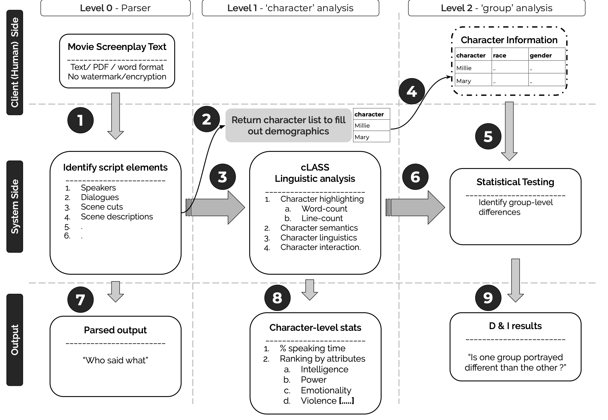

# mica cLASS pipeline

This repository contains the main functions for the cLASS (Computational Linguistic Analysis of ScriptS) project.

The process flow diagram is 

The [mica-text-script-parser](https://github.com/usc-sail/mica-text-script-parser/releases/tag/v0.0) is used to parse screenplays.

[Gspread](https://github.com/burnash/gspread) is used to create and share Google spreadsheets.

_micaclasssail_ Google account is used to store the spreadsheets and send emails.